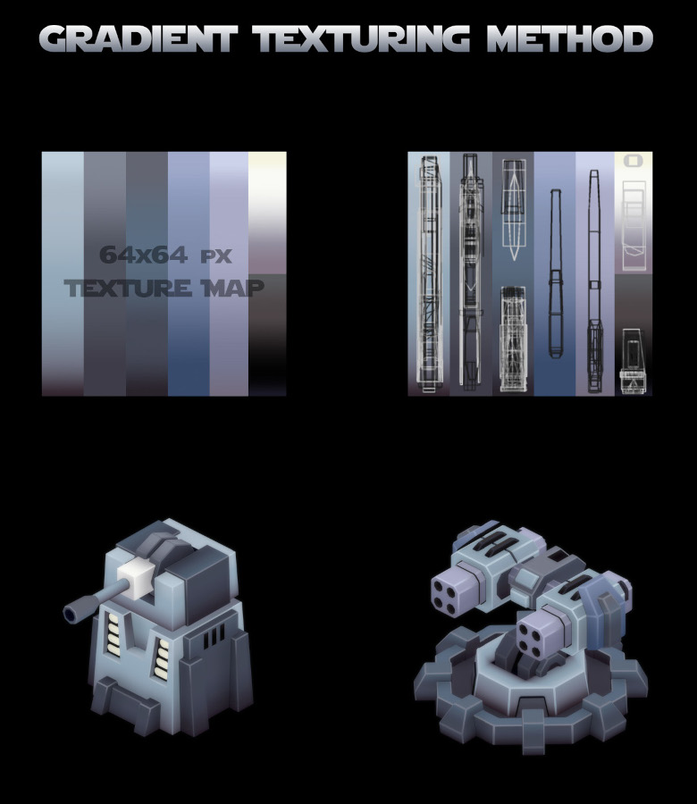
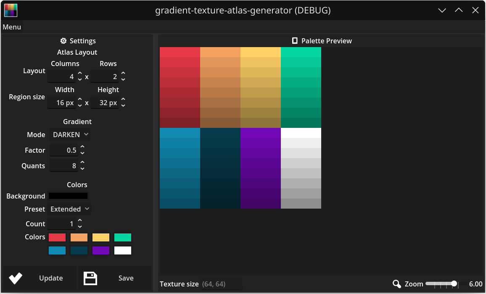
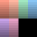

# Gradient Texture Atlas Generator

Tool application for generating atlas images for low poly model texturing with gradient textures.

Quick example of application:

[Article about technique](https://itch.io/blog/797457/optimization-of-3d-texturing-for-mobile-games-definition-of-the-gradient-texturing-process-and-analysis-of-its-efficiency-and-performance-in-engine)

Main Window:

# Examples 

Produced palettes presets and generated atlas textures:

|Palette|Atlas Texture (64x64)|
|-----|-----|
|Extended (8 colors)||
|Pastele (6 colors)||
|Noir (5 colors)||